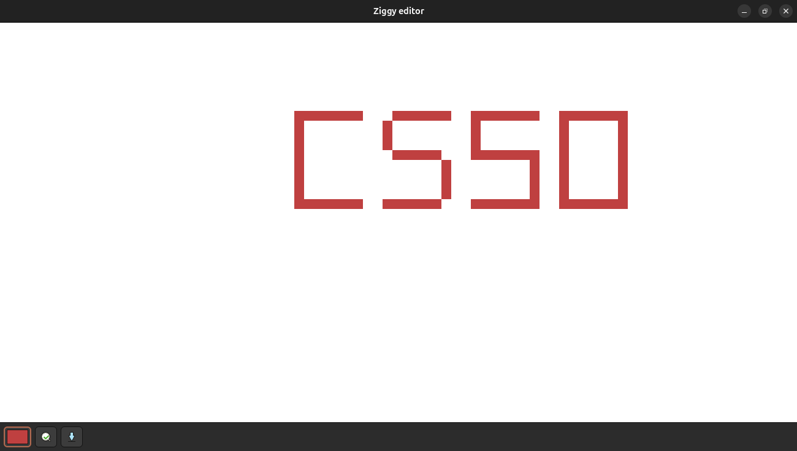
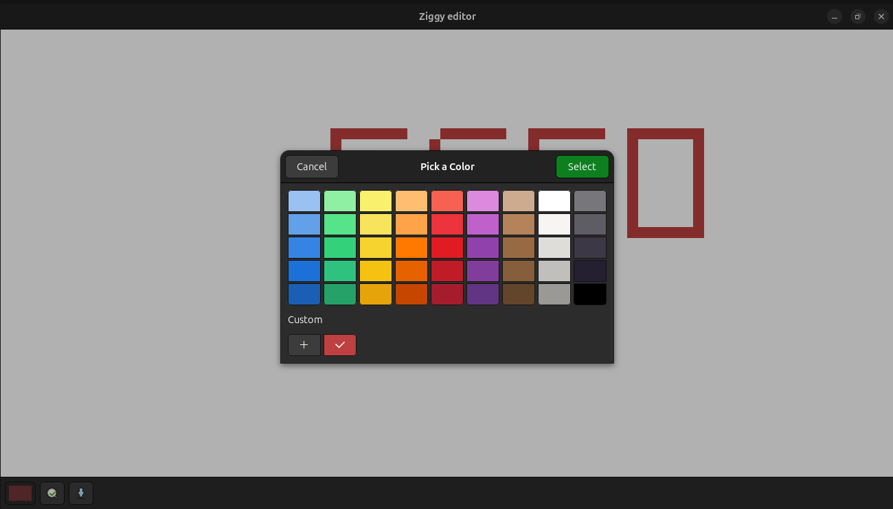
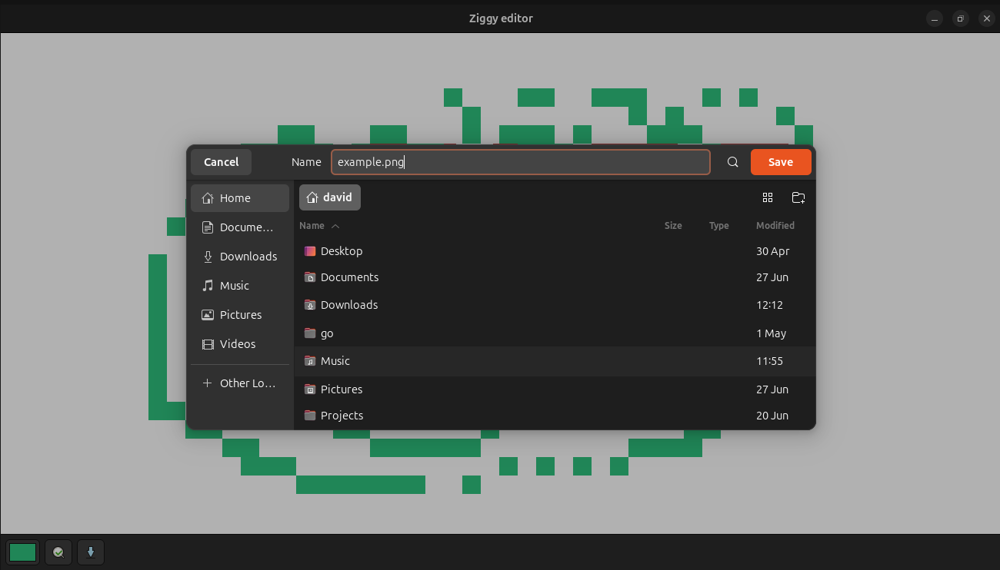
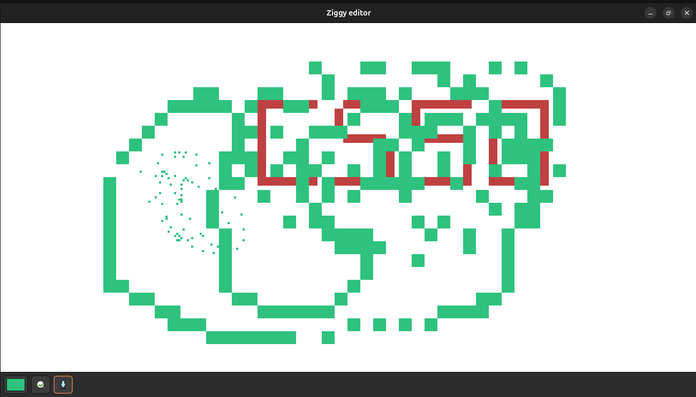

# ziggy sprite 
#### Video Demo:  <URL HERE>
#### Description:

A small pixel art editor made with GTK (C). It allows to do simple drawing in a custom canvas and then save it. It's super simple, it doesn't have the standard features of similar programs such as undo and redo. This is a WIP, though sufficiently complete to draw a basic sprite and save it.

#### About this project

This is the final project for my CS50 grade. Throughout the course I develop a strong interest in C. I really want to dig into it because I fell the course didn't get deep enough on it. I wanted to do a project in C, not a *command line application* nor *library* but an actual app with GUI. I bump into [GTK](https://www.gtk.org/) and feel it was the right tool for the job.

This project was way beyond my C capacities, you can check it commit history and see that it took several months to be complete. I haven't yet become as proefficient in C as I want to be.

#### Installation

Clone this repository and then `cd` to it. Then execute `make`, it should generate an executable *app* which then can be execute `./app`

##### Controls:

- LButton: paint
- RButton: erase
- Shift + LButton: paint straight line

The action bar contains 3 buttons:

- Set color
- Change brush size
- Save file

#### Folder structure

- src: main modules
    - action.c: action bar controls
    - action.h: action module declarations
    - brush.c: brush properties
    - bruhs.h: brush module declarations
    - canvas.c: drawing controller
    - canvas.h: drawing module declarations
- ui:
    - window.ui: main window of the application
- main.c: entry point of the program
- Makefile: compiler options

#### Roadmap

This is the final project for CS50, but I don't plan to freeze its development. As I said before this is a WIP, it is not yet tooo comfortable or practical for medium use cases (E.g tiles or backgrounds).

- [] open a file for editing
- [] undo and redo
- [] bucket tool

These are the main features for this application to be in its first stable version (in addition to fix some bugs it has).

#### Gallery

